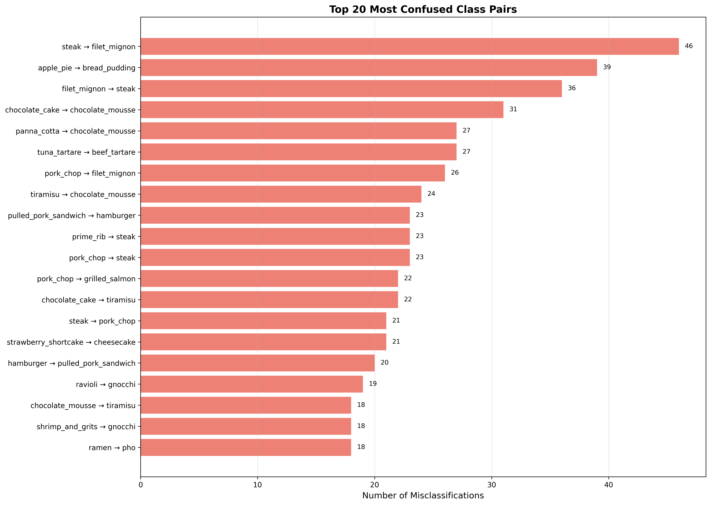
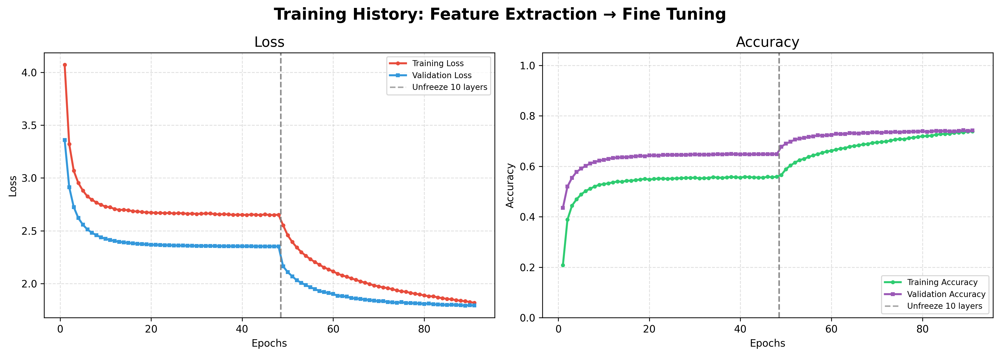

# Food Vision 101 🍔🥗🥙🌮

**TensorFlow • Transfer Learning • 101 Food Classes**

**TensorFlow Transfer Learning Project** — Building a powerful image classifier that can recognize **101 different food types**.


## Overview

This project is part of my journey through **Daniel Bourke's TensorFlow Developer Certificate** course. It demonstrates end-to-end transfer learning using modern convolutional neural networks (EfficientNet) on the famous **Food101** dataset.

I started with **10% of the data** to get fast results, then scaled up to the **full dataset**. I also performed detailed error analysis using confusion matrices to understand where the model gets confused and how to improve it.

## Key Features

- Transfer Learning with **EfficientNetB0** (and B4)
- Data augmentation techniques
- Comprehensive model evaluation
- Confusion matrix analysis + error investigation
- Scaling from 10% to 100% of the dataset
- Clean, reproducible code structure

## Dataset

- **Name**: Food101
- **Classes**: 101 food categories
- **Training Images**: 75,750 (full) | 7,575 (10%)
- **Test Images**: 25,250
- Source: [Kaggle - Food101](https://www.kaggle.com/datasets/dansbecker/food-101)

## Results

### Model Performance

| Model                    | Dataset          | Accuracy | Training Time |
|--------------------------|------------------|----------|---------------|
| EfficientNetB0           | 10%  (7,575 img) | [58.8%]  | ~8 minutes    |
| EfficientNetB0           | Full (75,750 img)| [74.19%] | ≈ 3h 58m      |


### Visual Results on 10%dataset




## Most Confused Classes

- `Steak` ↔ `filet_mignon`
- `apple_pie` ↔ `bread_pudding`
- `choclate_cake` ↔ `choclate_mousse`

I created custom code to analyze and address these confusions.

## Technologies Used

- **TensorFlow** 2.x
- **TensorFlow Hub**
- **EfficientNet** (pre-trained models)
- Matplotlib, Seaborn, Scikit-learn
- Google Colab

## Project Structure

```bash
food-vision-tensorflow/
├── notebooks/           # Main Jupyter notebooks
├── src/                 # Reusable Python modules
├── data/                # Dataset (ignored)
├── models/              # Saved models
├── images/              # Visualizations & results
├── README.md
├── requirements.txt
└── .gitignore
```
## How clone the repo to you pc
```bash
git clone https://github.com/salaheddinegv-phar/tensorflow-food-vision.git
cd tensorflow-food-vision
```
## Install dependencies 
```bash
pip install -r requirements.txt
```
## How download the full dataset and organize it AUTO to train and test folder
```bash
python src/download_dataset.py
```
##  Training the Model
#Train on 10% Dataset 
```bash
python src/train.py `
  --train_dir data/train `
  --test_dir data/test `
  --initial_epochs 15 `
  --fine_tune_epochs 10 `
  --batch_size 32 `
  --patience 3`
  --model_save_path models/food_classifier_10percent.keras `
  --experiment_name "EfficientNetV2B0_10Percent"
```
#Train on Full Dataset 
```bash
python src/train.py `
  --train_dir full_data/train `
  --test_dir full_data/test `
  --initial_epochs 20 `
  --fine_tune_epochs 15 `
  --batch_size 32 `
  --patience 5`
  --model_save_path models/full_food_classifier.keras `
  --experiment_name "EfficientNetV2B0_Full"
```
## All Available Arguments
```feuilles de calcul
| Argument                 | Description                 | Default                               | Example                 |
| ------------------------ | --------------------------- | ------------------------------------- | ----------------------- |
| `--train_dir`            | Path to training data       | **Required**                          | `data/food-101/train`   |
| `--test_dir`             | Path to test data           | **Required**                          | `data/food-101/test`    |
| `--initial_epochs`       | Feature extraction epochs   | `20`                                  | `15`                    |
| `--fine_tune_epochs`     | Fine-tuning epochs          | `15`                                  | `10`                    |
| `--batch_size`           | Batch size (adjust to VRAM) | `32`                                  | `64`                    |
| `--patience`             | Early stopping patience     | `5`                                   | `3`                     |
| `--model_save_path`      | Where to save the model     | `models/food_classifier.keras`        | `models/my_model.keras` |
| `--checkpoint_dir`       | Checkpoint directory        | `models/checkpoints`                  | `checkpoints/`          |
```
## 📋 All Available Arguments
```Feuilles de calcul
Argument	Description	Default	Example
--train_dir	Path to training data	Required	data/food-101/train
--test_dir	Path to test data	Required	data/food-101/test
--initial_epochs	Feature extraction epochs	20	15
--fine_tune_epochs	Fine-tuning epochs	15	10
--batch_size	Batch size (adjust to VRAM)	32	64
--patience	Early stopping patience	5	3
--model_save_path	Where to save the model	models/food_classifier.keras	models/my_model.keras
--checkpoint_dir	Checkpoint directory	models/checkpoints	checkpoints/
--log_dir	TensorBoard log directory	Tensorflow_hub_log	logs/
--experiment_name	Name for TensorBoard	EfficientnetV2B0	MyExperiment
--save_training_curves	Path to save loss curves	images/combined_training_curves.png	results/curves.png
```
## 📜 License

This project is released under the [MIT License](LICENSE).

The Food-101 dataset is provided by [ETH Zurich](https://data.vision.ee.ethz.ch/cvl/datasets_extra/food-101/) and is used here for research and demonstration purposes. The model architecture, training pipeline, and evaluation code are original work.

## 👤 About the Author

**Salah Eddine** — Machine Learning Engineer specializing in computer vision and production-ready deep learning pipelines.

- 🔗 [LinkedIn](your-linkedin-url)
- 💻 [GitHub]([your-github-url](https://github.com/salaheddinegv-phar))
- 📧 salaheddinegv@gmail.com

**Open to freelance opportunities .** If you're building something with computer vision, let's talk.

##🙏 Acknowledgments
[Daniel Bourke](https://github.com/mrdbourke) — TensorFlow Developer Certificate Course
[Food-101 Dataset](https://data.vision.ee.ethz.ch/cvl/datasets_extra/food-101/) — ETH Zurich
